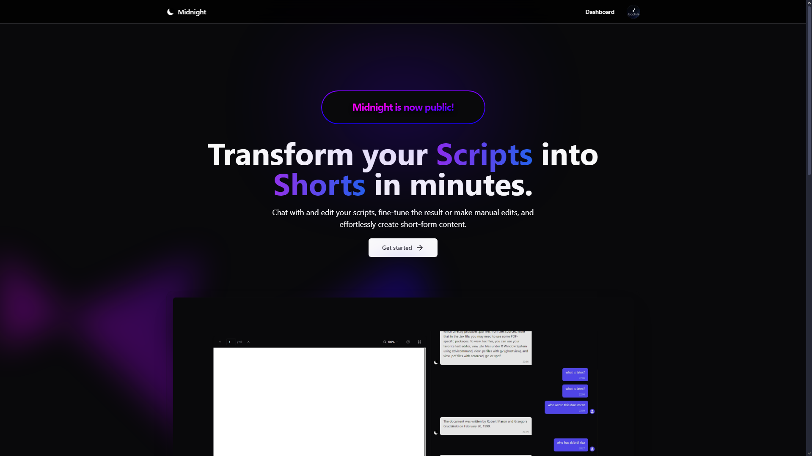
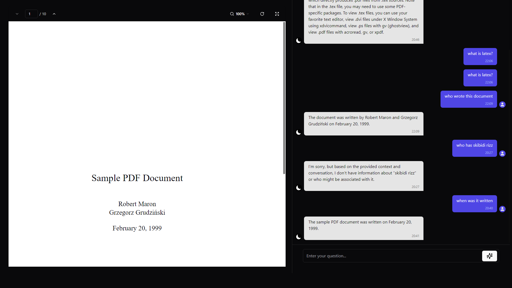
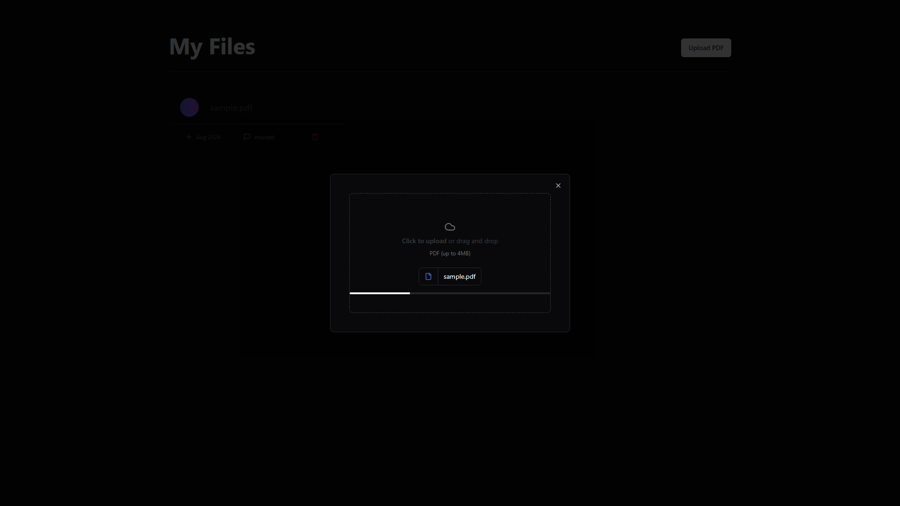

# Midnight

Midnight lets you chat with your documents, fine-tune the final script and effortlessly create short-form content.
Simply upload your file and start creating right away.

## Technologies used

    
     
    
    
    
    
    
    
    
    
    

## Deployment

This project is deployed on Vercel and can be found at [midnightai.vercel.app](https://midnightai.vercel.app/).

To sign into Midnight, just use an email and password then verify your email. Further sign-in options will be added in
the future.

## Media

